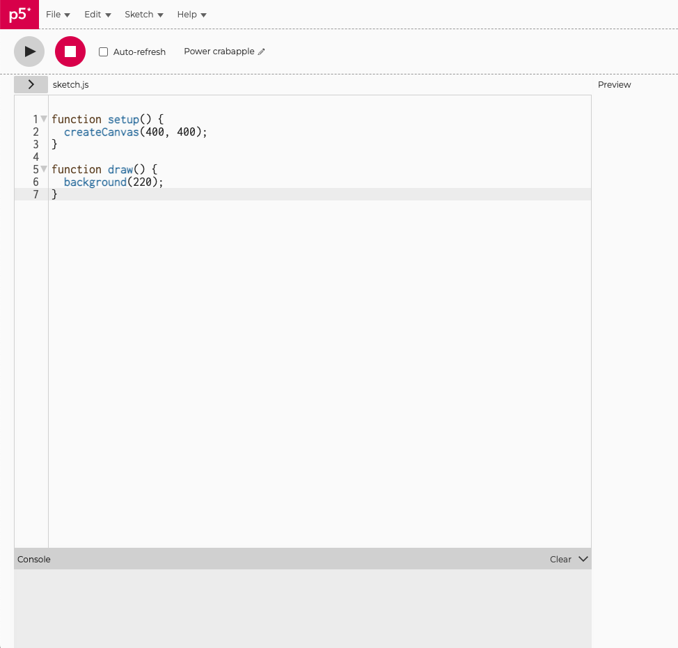
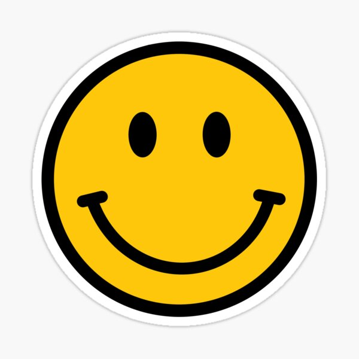

---
# This is the frontmatter
title: "Instructional Art: Lessons" # Title and Heading 1
permalink: /instructionalArt-Lessons/ # Give your page a permalink
published: true

gallery: # Below is for including an image gallery
  - url: Assets/Screenshot_2024-07-29_at_5.08.31_PM.png
    image_path: Assets/Screenshot_2024-07-29_at_5.08.31_PM.png
    alt: "Screenshot of a collage on books using the p5.js web editor"
    title: "About Me Collage"
  - url: /assets/images/unit_a_example-2.png
    image_path: /assets/images/unit_a_example-2.png
    alt: "simplified line drawing of a face with red oval pattern"
    title: "Sample Drawing 2"

---

## Let’s make — an About Me Collage!

**🔗 Template link here:** [https://editor.p5js.org/chellyjin/sketches/8-TuqGyaq](https://editor.p5js.org/chellyjin/sketches/8-TuqGyaq)


## What we need to begin

- Computer with p5.js on web browser (Google Chrome)

## Objectives

- Understanding the basics of the p5.js web editor
- Becoming comfortable with writing in Javascript syntax: finding, debugging and writing brackets, brackets vs. parenthesis, semi-colons for statements, and functions
- Creating a digital collage using p5.js code
- Learning about instructional art, engaging with conceptual artists that use instruction-making as art practice
- Linking history in instructional art as related and connected to history of computation. Understanding the resonance between computation, code, and art.

---

## Unplugged Activities
### Chance Operations
**Materials you need:**

- Quarter or any coin, for each student
- 2 sheets of Paper
- Pencil, Pen, Markers

**Instructions** 

Part 1: 

1. Create a print out or have students fold a piece of paper in half (portrait / vertical). Have students write at the top of the paper “Heads” and “Tails” on the two halves. 
2. Then, they create a list of pairs. A pair of shapes, art forms, colors etc. in a duetted list. Feel free to call out the categories, or if older students, allow them to create their own. Like below:
    
    
    |  | Heads | Tails |
    | (Color) | Green | Blue |
    | (Shape) | Circle | Triangle |
    | (Line style) | Straight | Squiggly  |
    | (Drawing tool) | Color pencil | Marker |
3. After the list is done, using **Chance Operations,** students will flip a coin to determine aspects of their drawing within each category. For the example of colors, if the coin is Heads — the student will use Green color as their main color. Have students circle which one “won” to make it easy. Here’s my own result:
    
    
    |  | Heads | Tails |
    | (Color) | Green | Blue |
    | (Shape) | Circle | Triangle |
    | (Line style) | Straight | Squiggly  |
    | (Drawing tool) | Color pencil | Marker |

Part 2: 

1. Students will now create a simple sketch with these results on the back of the paper or on a new sheet of paper. In the previous example, I will make a drawing using Green Color Pencils of Squiggly Triangles.

---

# The Lessons

⏰ Each of the 4 lessons will take approximately 20-25 minutes

🔗 Template link here: [https://editor.p5js.org/chellyjin/sketches/8-TuqGyaq](https://editor.p5js.org/chellyjin/sketches/8-TuqGyaq)

## Vocabulary

1. Code Editor and Web Editor
2. Reference and Examples
3. Code syntax:
    1. Brackets
    2. Functions
    3. Semi-colon
    4. Commas
    5. Parenthesis
4. Preload and Load
5. Media: ie. Images, Video, Gifs

## Lesson Plan 0: How to Use p5.js

### Understanding p5.js

- p5.js: [https://p5js.org/](https://p5js.org/)
    - Editor: [https://editor.p5js.org/](https://editor.p5js.org/)
        - Where we make and execute our code
        - Create your own account (it’s free!)
    - Reference: [https://p5js.org/reference/](https://p5js.org/reference/)
        - Like a glossary of terms, concepts, and functions.
    - Examples: [https://p5js.org/examples/](https://p5js.org/examples/)
        - Offers code that expand on more unique concepts to show the breadth of p5 possibilities.

### Learning more about p5.js

- Community Guide: [https://p5js.org/community/](https://p5js.org/community/)
- Getting Started with p5.js Book: [https://p5js.org/books/](https://p5js.org/books/)
- The Coding Train: [https://www.youtube.com/@TheCodingTrain](https://www.youtube.com/@TheCodingTrain)
- Public vs. Private code // What is “Open source”?
    - [https://opensource.com/resources/what-open-source](https://opensource.com/resources/what-open-source)
    - Know that anything you create in p5.js is now public to the world, anyone can now access your code, images, and text that you upload— it becomes a resource.

[https://github.com/processing](https://github.com/processing)

### p5 Editor Basics

**Let’s take a look at the editor:** 



**What do you notice?**

- **setup()**
    - { code that runs once }
- **draw()**
    - { code that runs forever until you stop it.
    - But there is an order! The code here runs from top to bottom, then repeats until you quit the program. Each time the code is run through draw(), we consider this a frame.
    - Similar to camera or film, there is a frame per second that the code is run. p5.js has a default of running the code 60 times per second aka 60 frames per second. We can change the frame rate, using frameRate(#);
    - Think of a flip book animation created on screen by drawing an image, then drawing a slightly different image, then another, and so on. The illusion of fluid motion is created by persistence of vision. When a set of similar images is presented at a fast enough rate, our brains translate these images into motion. }
- **createCanvas(w, h);**
    - The w = width and h = height set the Canvas width and height
    - Play with the background color using ***background(r,b,g);*** to see the size of the canvas you created

---

## Lesson Plan 1: Syntax

Take a look at the basic syntax

- Functions have **()**
- Code related to the function are between **{ }**
- Properties are separated by commas **(x,y)**
- We end an instruction with a **semi-colon;**

**Order matters in your code!** 

The code will run first what is in setup(), preload(), then draw() and then within draw() it will repeat it from TOP to BOTTOM. 

This translates to TOP of the code == BACK of the canvas, and BOTTOM of the code == FRONT of the canvas.

**Harvard Professor Explains Algorithms in 5 levels of Difficulty:** [https://youtu.be/fkIvmfqX-t0?si=1OCPmfbOraYCRn7i&t=48](https://youtu.be/fkIvmfqX-t0?si=1OCPmfbOraYCRn7i&t=48)

The idea is that we’re telling the computer a series of instructions. And the order does matter – the bread needs to go down first, before the peanut butter. Just like how we need to add fill() before the objects to indicate which color marker we’re picking up next. And the specificity of these directions also matter:

**🧠 Teacher Trick:**
Print out code on sheets of paper (pull from the example or templates of any and all projects/exercises). Have the students highlight, with different markers or highlighters, the bracket pairings in such a way that each bracket pairing is a different color marker. Help students identify where their code needs to go and look for brackets. As conditionals come into play or code gets longer, this activity will help student succeed in future debugging.


---

## Lesson Plan 2: Shapes + Colors + Text

### Shapes

[https://p5js.org/reference/#group-Shape](https://p5js.org/reference/#group-Shape)

**Let’s start with trying some things out~**

Try using functions the below and swapping out the letters in pink with **numbers**:

- createCanvas(w, h);
- circle(x, y, d);
- ellipse(x, y, w, h);
- rect(x, y, w, h);
- line(x1, y1, x2, y2);

**Prompt:** How’d it go? What do you notice?

```jsx
function setup(){
	createCanvas(600,600);
}
function draw(){
	// circle(x=150, y=150, d=250);
  circle(150, 150, 250);
  // rect(x=500, x=400, w=200, h=400);
  rect(500, 400, 200, 400);
}
```

Notice, each one has their own syntax on HOW to use it

- circle(x, y, d);
    - X = center point’s X position
    - Y = center point’s Y position
    - D = diameter of circle
- rect(x, y, w, h);
    - X = top left corner’s X position
    - Y = top left corner’s Y position
    - W = width of rectangle
    - H = height of rectangle

Look into the Reference page to help you define how these functions work and how they need to be written!

**🧠 Teacher Trick**

Think of Functions and their Properties and how they might apply to the real world. Instead of Ellipse(x,y,d) → Bread(where does it go, how many slices)

- We could say: **Bread(plate, 1, rye, 70%)** — The function of bread and the properties of where we place the bread in space and how many slices, etc. Or we could additionally have optional properties like: grain type (rye, wheat, buckwheat) or hydration (70% vs 90%)
- We could say:** Flower(grass, pink, 5, short)** — The function of Flower and the properties of where is the flower (in grass), what color is the flower (pink), how many petals does it have (5), what is the height (short).
- So when we say things like **Circle(x, y, d)**; at the top of our code – we’re suggesting, “hey put a Circle down on the canvas first. And what’s that circle like: well it’s placed at “x and y”, and it “d” pixels in size.

**🎨 In our About-Me Collage example:** We started the draw() section with shapes. We have a series of circles and rectangles. 

```jsx
function draw(){
    
  fill(201, 127, 56);
  circle(150, 150, 250);
  fill(201, 189, 56);
  rect(500, 400, 200, 400);
  fill(227, 149, 100, 100);
  circle(100,500,400);
  fill(227, 149, 100, 100);
  circle(800,100,400);
  
}
```

What is the fill() function? Perfect segue to: color!

### Colors

[https://p5js.org/reference/#group-Color](https://p5js.org/reference/#group-Color) 

**Again, let’s start with trying out these functions below.** Swap out the colors in pink with some **numbers.** 

- fill(g);
- fill(r, g, b);
- fill(r, g, b, a);
- stroke(r, g, b, a); // color
- strokeWeight(w); // size
- background(r, g, b);

**Prompt:** What do you notice? What do you think the RGB stands for in fill()? What about when the G is solo in fill()? What about the A?

- *🙋🏻‍♀️ Answer*
    - RGB as in fill(r,g,b); stands for Red, Green and Blue
    - G as in fill(g); stands for Grey, as in Greyscale
    - If there is 1 parameter in the function, p5 will assume you’re referring to a Greyscale value == fill(g);
    - If there are 2 parameters in the function, p5 will assume you’re referring to a Greyscale value and an Alpha value == fill(g,a);
    - If there are 3 parameters in the function, p5 will assume you’re referring to RGB == fill(r,g,b);
    - If there are 4 parameters in the function, p5 will assume you’re referring to RGB and an Alpha value == fill(r,g,b,a);
    

Let’s review:

```jsx
function draw(){
	//fill(red=255, green=0, blue=0, alpha=50); this is out of 255
	fill(255, 0, 0, 50);
	//stroke(red=255, green=0, blue=0);
	stroke(255, 0, 0);
}
```

We use functions like fill() or stroke() – to fill the object with a color, or to outline the object with a color.

- fill(r, g, b, a);
- stroke(r, g , b ,a);
    - r = red
    - g = green
    - b = blue
    - a = alpha (transparency)
    - values go up to 255. This is a common convention in many other tools.

**🎨 In our About-Me Collage example:** To go back to our code template and example, you can see between each shape is a different fill color. And also, instead of coloring a stroke, we can use a function called “noStroke();” to remove stroke weights from our shapes. So this will only be different filled colored shapes with no stroke:  

```jsx
function draw(){
	
	// ADD SHAPES + COLORS
  noStroke();
  fill(201, 127, 56);
  circle(150, 150, 250);
  fill(201, 189, 56);
  rect(500, 400, 200, 400);
  fill(227, 149, 100, 100);
  circle(100,500,400);
  fill(227, 149, 100, 100);
  circle(800,100,400);

}
```

We use other functions to play with the outline of shapes: 

- noStroke(); == removes all stroke weight
- strokeWeight(n); == changes stroke weight / thickness
- stroke(r,g,b,a); == like fill() except, it colors the outline of the shape

🧠 **Teacher Trick**
Think of fill() or stroke() as **the marker**! In code, ORDER MATTERS. Sometimes it helps to envision the instruction as:

fill(255,0,0); == PICK UP the RED marker
circle(100,100,100); == Use the red marker to draw the circle 
fill(0,255,0); == PICK UP the GREEN marker 
circle(200,200,200); == Use the green marker to draw the circle
fill(0,0,255); == PICK UP the BLUE marker 
circle(300,300,300); == Use the blue marker to draw the circle


### Text

We use functions like text() – to add text to our p5.js Canvas. Note that this is not the same as an HTML, p.Element, etc. 

```jsx
text("insert your text here", x, y, [optional textbox width], [optional textbox height]);
```

**🎨 In our About-Me Collage example:** We can add quotes or fun text, even emojis to our collage.

```jsx
function draw(){

	// ADD TEXT + TEXT SIZE + FONTS
  textFont("Courier New");
  textSize(32);
  stroke(201, 138, 56);
  strokeWeight(5);
  fill(82, 50, 10);
  text(
    "“Beware; for I am fearless, and therefore powerful.” — Mary Shelley, Frankenstein",
    153,
    502,
    400
  );
  // ADD EMOJIS
  textSize(100);
  text("🖋️📝📚", 500,200);
  
}
```

Notice, we can also add unique characteristics to make our text interesting:

- fill(), stroke() and strokeWeight() will impact the color of the text
- textFont(“font name”); == We can select from a predetermined list of available fonts. The default is Helvetica.
- textSize(n); == Change the size of your text

### Practice

**Start here (Easy)**

How might you create 3 circles of different sizes layered on top of each other with different colors each? 

- 🙋*Answer*
    
    ```jsx
    function setup() {
      createCanvas(400, 400);
    }
    
    function draw() {
      background(220);
      //Red, Large circle 
      fill(255,0,0);
      circle(200,200,300);
      
      //Green, Medium circle 
      fill(0,255,0);
      circle(200,200,200);
      
      //Blue, Small circle
      fill(0,0,255);
      circle(200,200,100);
    }
    ```
    

**Extra push (Hard)**

How might you create a classic yellow smiley face with the shapes and colors you’ve learned so far? 

- 🙋*Answer*
    
    This is certainly not the only answer - as this question is open to interpretation, but can be helpful in reference:
    
    ```jsx
    // Reference image: https://ih1.redbubble.net/image.3888616900.2564/st,small,507x507-pad,600x600,f8f8f8.jpg
    
    function setup() {
      createCanvas(400, 400);
    }
    
    function draw() {
      background(220);
      // Yellow circle with black stroke 
      fill(255, 208, 0);
      circle(200,200,300);
      stroke(0);
      strokeWeight(10);
      
      // Eyes
      fill(0);
      ellipse(150,150,30,50);
      ellipse(250,150,30,50);
      
      // Mouth
      noFill();
      arc(200,200,200,200, PI*2, PI);
      line(90,200,110,200);
      line(290,200,310,200);
    
    }
    ```
    



### Prompts

1. Without worrying about the actual code syntax, how might you write instructions for a friend on how you’d design a flower? Or a house? A rainbow? 
2. How does it feel to write out every specific instruction for every action the computer needs to take: like writing fill() as in every time one needs to change color / pick up a new “marker”? Can you think of other examples in the world where clarify and specificity is useful and necessary? 

---

## Lesson 3: Importing Images and Media

This applies for all media: images, video, gif: [https://p5js.org/reference/#group-Image](https://p5js.org/reference/#group-Image)

### Preloading any media

- **preload()**
    - { code that runs before the draw() code begins
    - Helpful when you have media. Otherwise, sometimes the code will look for the images / sound / video. And if it isn’t there, the program will freak out. Preloading your media prevents this issue. }

Use the preload() function to ensure that your media is uploaded before the code runs to prevent issues.

In the example below “img” is the variable name, and we’re assigning it the value of the loaded image. 

img = loadImage('assets/yourImageFileNameHere.jpg');

---

Don’t worry if you don’t know what a variable is quite yet! We’ll cover that in our next unit. Try it out for now. 

### Loading Images

Images can be loaded directly into your p5.js sketch on the Editor, using the “+” button next for your Sketch Files. There are file size limitations on the web editor.

[https://lh7-rt.googleusercontent.com/docsz/AD_4nXdY2Nb5H5AShRstLx5SkI4Ho3xNRfZcxQRKcCVc9H6K4u92R_i_H8HJDwFMBBSgtiKXmaYjWIF-gsnyVaiFpLFd2TZHALO_CgkQubmRKnqawisDHysjl7MAdZXOgZJBBGRG0MGQ1eSUO_HheV1kbhLM-4Y?key=F-S1j5G6bHDaZ0HWIyKiDw](https://lh7-rt.googleusercontent.com/docsz/AD_4nXdY2Nb5H5AShRstLx5SkI4Ho3xNRfZcxQRKcCVc9H6K4u92R_i_H8HJDwFMBBSgtiKXmaYjWIF-gsnyVaiFpLFd2TZHALO_CgkQubmRKnqawisDHysjl7MAdZXOgZJBBGRG0MGQ1eSUO_HheV1kbhLM-4Y?key=F-S1j5G6bHDaZ0HWIyKiDw)

Images can be loaded using links from websites: refer to class About Me template.

Tips

- Make sure that your file name is exactly as written on your file, and you can always rename it in the Editor
- Always make sure your put media in preload() and within a variable (we will go over variables in the following unit).

```jsx
let img;

// Load the image into a variable called img
function preload() {

	img = loadImage('assets/yourImageFileName.jpg');

}

function setup() {

	createCanvas(100, 100);

	// Draw the image using the image function
	image(img, 0, 0);

}
```

### Loading other media

Try loading a gif, image (png, jpg), or even [fonts](https://p5js.org/reference/#/p5/loadFont)!

If you want to try using videos: [https://p5js.org/reference/#/p5/createVideo](https://p5js.org/reference/#/p5/createVideo)

- Example: [https://editor.p5js.org/Jaesar/sketches/TGyEC6OYB](https://editor.p5js.org/Jaesar/sketches/TGyEC6OYB)
