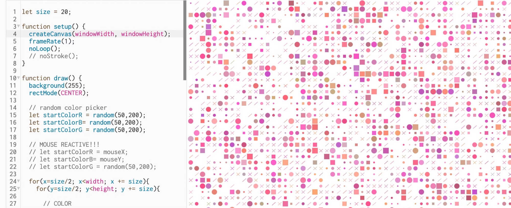

## Let’s make — Generative Weaving Pattern!

**Template link here:** [https://editor.p5js.org/chellyjin/sketches/3-7xyzKng](https://editor.p5js.org/chellyjin/sketches/3-7xyzKng) 



## What we need to begin

- Computer with p5.js on web browser (Google Chrome)
- Mouse

## Objectives

- Understanding the code basics of loops and looping and becoming comfortable with using p5 elements: random(), frameRate(), noLoop()
- Creating a “weaving” program that generates new, unique patterns based on programmatic randomness
- Learning about the history of computation and it’s relationship to weaving
- Introduction to generative art and its relevant artists in this space

---

# Unplugged Activities


---

# The Lessons

⏰ Each lesson will take approximately 20-25 minutes

3️⃣ Lessons

🔗 Here the link to the main template we will be learning from : [https://editor.p5js.org/chellyjin/sketches/ppfJ4V0YW](https://editor.p5js.org/chellyjin/sketches/ppfJ4V0YW) 

## Vocabulary

1. Random + Randomness
2. Frame Rate
3. Loops and Looping 
    1. For Loop
    2. Nested Loops 
    3. While + Do Loops 
4. If-Then (Recap) 

## Lesson Plan 1: Random + FrameRate + noLoop

Remember this:

- **setup()**
- { code that runs once }
- **draw()**
    - { code that runs forever until you stop it.
    - But there is an order! The code here runs from top to bottom, then repeats until you quit the program. Each time the code is run through draw() is a frame.
    - Similar to camera or film, there is a frame per second that the code is run. p5.js has a default of running the code 60 times per second aka 60 frames per second. We can change the frame rate, using frameRate(#);
    - Think of a flip book animation created on screen by drawing an image, then drawing a slightly different image, then another, and so on. The illusion of fluid motion is created by persistence of vision. When a set of similar images is presented at a fast enough rate, our brains translate these images into motion.
    - }

Well, let’s add some new friends:

- **frameRate()**
    - **changes the amount of times the code runs per second**
    - which can give the illusion of a slower animation but is also the code literally running less times or at a lesser rate/speed
- **noLoop()**
    - If this is in your code, it will not continue looping / running continuously like it normally does!
- **random()**
    - Pulls a “random” digit within a range of specified numbers
        - random(25,50); will pick a random number ever frame between 25 and 50
    - But if you only put in one number, it defaults between that number and 0
        - random(50); will pick a random number ever frame between 0 and 50

### Prompts

1. What is the difference between a Function (ie. mousePressed) and a Boolean (ie. mouseIsPressed)? And what does the interaction or output look like: how are they similar? how are they different? 
2. What are the ways we’ve used mouseX and mouseY in this session? How else might we use mouseX and mouseY? (Consider other games: Pong, Lilo & Stitch Sandwich Stacker games) 
3. What might you use a mouse interaction for? Can you list a few ideas? 

---

## Lesson Plan 2: For-Loops

From the University of Utah, the “for loop is used to repeat a section of code a known number of times. Sometimes it is the computer that knows how many times, not you, but it is still known.” The beauty of code is the efficiency in repeating things continuously, effectively and quickly. The for loop is helpful for anything you have to repeat code continuously.

For loops will generally appear in this format:

```jsx
for (i = 0; i < #; i++) {

	Code you want to repeat here

}
```

Let’s break it down:

- “for” : is telling the computer, let’s loop through this block of code
- i = 0; : let’s start at the number 0
- i < #; : and repeat it from 0 until the number is greater than #
- i++; : and repeat it in increments of +1

Here’s another fun example:

```jsx
for (let step = 0; step < 5; step++) {

	// Runs 5 times, with values of step 0 through 4.

	console.log("Walking east one step");

}
```

I like to think of:

- The first number as where we’re standing / starting at (step =0).
- The second number as where we’re trying to go or want to end up (step < 5)
- And the step++ as setting the stride we’re taking to get there. You can modify the step++ to be other increments, like i+= 5 for increments of 5, etc.
- And what are we doing every step? We’re writing “Walking east one step” in the console log!

So, what is the point of using Loops?

### Let’s Start Easy: A Line of Circles

Say, I want to draw a bunch of circles. I could do the following:

```jsx
function draw() {
	ellipse(0, 100, 100);
	ellipse(100, 100, 100);
	ellipse(200, 100, 100);
}
```

What do you see? (Answer: 3 circles on your canvas!)

But imagine if you had 100 circles to make? You’d have to hand write this code one hundred times. That’s too much work. 

**The joy of loops is how great they are for repetitive instructions.** 

Instead of writing 3 commands for 3 different ellipses, we can condense it using a for-loop like this: 

```jsx
function draw() {
   for(i=0; i<width; i += 100){
     ellipse(i, 100, 100);
   }
}
```

This is saying:

- Starting at **0** (”i=0”
- And keep looping until we reach **width** (aka, the end of the width of canvas)
- Repeat the { instructions between the brackets } **once every 100 steps**
- And what are we doing every step? We’re drawing an ellipse! And the **ellipse is drawn** at the **x-coordinate** of whatever the **variable of “i”** is. The y-coordinate will always be at **100px,** which is what makes it drawn in a line. And the size will always be **100px** in diameter.

Why repeat only once every 100 steps? If we had the last phrase as **i++,** then it’d **draw a new circle every single pixel after 0, instead one circle every 100 pixels after 0.** Try it out:

```jsx
function setup() {
  createCanvas(400, 400);
}

function draw() {
   for(i=0; i<width; i++){ // try replacing the increments here
     ellipse(i, 100, 100);
   }
}
```

Something you might ask is: why is the first cut off in half? It’s because we started the loop at i=0. Ellipse’s use the (x,y) coordinates for their center point, so x = 0, will make the center point of the ellipse start at the beginning. How can we shift it over?

Start at the circle’s radius! So the x starts at the circle’s center point: 50px~ 

```jsx
   // if we want to move it to center, move the starting dot 
   for(i=50; i<width; i += 100){
     ellipse(i, 100, 100);
   }
```

### Time to Level Up: A Grid of Circles

So we now know how to make a line of many circles. How about a **grid** of circles? 

We can use nested for-loops for the x-axis and then the y-axis.

Check out the code below

```jsx
  // let's make a grid of circles
  for(x=50; x<width; x += 100){
    for(y=50; y<height; y += 100){
       ellipse(x, y, 100); 
    }
  }
```

We’re saying here:

- (x=50;) Place your **x** value start from **50**
- (x<width;) Keep iterating until your hit the **width**
- (x += 100) Do this in increments of **100**
- And what are we doing every step?….

Every time we run through this, we also want it to run through another loop where:

- (y=50;) The **y** value starts **also at 50**
- (y<height;) Keep iterating until we end up in the **height**
- (y += 100) Do this in increments of **100** as well!
- And what are we doing every step? Drawing an ellipse! But this time, every time we draw an ellipse — it’s at the “x” value and the “y” value in the variables of our for loops.

So, for every step along the x-axis, we’re making a vertical column of circles down the y-axis! 

### Moving forward: How can we use the loops to add unique, different sizes and colors?

Using all our understanding of for-loops now, we can add to our instructions. 

**For Different Sizes:**

So far, we’ve been keeping a consistent size in the ellipse because we’ve used a hard number. But using our previous lesson in **random(),** we can use it to select a different size within a range of two numbers. 

Below, we’re saying: every time this instruction is run — draw an ellipse in a grid where each circle is now selecting a different size ranging from 25-100.

```jsx
  // let's now make each one different (in size)
  for(x=50; x<width; x += 100){
    for(y=50; y<height; y += 100){
       ellipse(x, y, random(25,100)); 
    }
  }
```

**For Different Colors:** 

Using our previous lessons in **random(),** we’re saying - hey, every time we run this instruction in the loop, find a **random number between 0 - 255** and **store it inside the variable: randColor**. 

```jsx
  // let's now make each one different (in color)
  for(x=50; x<width; x += 100){
    for(y=50; y<height; y += 100){
      let randColor = random(255);
      fill(randColor);
       ellipse(x, y, 100); 
    }
  }
```

Then, we will use our **fill()** function to fill our ellipse with the color that is selected from the variable in **randColor.** 

Let’s check out an example from our Generative Weaving template:

```jsx
let size = 20;

function setup() {
  createCanvas(windowWidth, windowHeight);
  frameRate(1);
  noLoop();
  // noStroke();
}

function draw() {

  for(x=size/2; x<width; x += size){
    for(y=size/2; y<height; y += size){
    
	    ellipse(x, y, int(random(5,size))); 
    
	}
}

}
```

This is saying, starting at “size/2” (our variable [20] divided by 2), we’ll keep repeating this code one at a time until we get to “width” (the full width of the canvas), in the increments of “size” (our variable [20] we’re using to maintain a consistency in spacing and sizes). 

---

## Lesson Plan 3: Adding your own flavor with If-Then Statements

Let’s start making your own weaving patterns. (Check out Assignments below for more inspiration on how to play around with presenting your weavings) 

An easy way to start integrating more uniqueness to your weaving, is by adding an If-Then Statement. This is a concept we’ve covered in Unit 3 Interactivity. If you’re unfamiliar with an If-Then statement, please take a moment to review that lesson. 

Using an if-statement and random(), we can make simple statements that add some unique variability into our generative weaving. 

### First, let’s create a “spinner”

In order to make an if-then statement, it has to be conditional on something to happen! So think of us creating the variable “selection” as like a spinner — every time we run draw(), it’s flicking a spinner to select a number. 

In draw(), we can create a variable called “selection” which will store a newly selected random number between 0-6. 

```jsx
function draw(){
	  let selection = int(random(0,6));
}

```

However, if we were to use random() it would select truly ANY number between 0-6 including all the variable decimals in between. 

Don’t believe me? Try it out! Use console.log to see the values:

```jsx
function draw(){
	let selection = random(0,6);
	console.log(selection);
}
```

To remedy this, we’ll add an **int()** to force whatever number is selected to round up or down to it’s nearest **INTEGER**.

Try it out :

```jsx
function draw(){
	let selection = int(random(0,6));
	console.log(selection);
}
```

### Now that we have our “spinner,” what happens next?

Well, that part is up to you! Based on what the “spinner” or our “selection” outputs, you can create an if-then statement to draw a different element. 

Check out our Generative Weaving Pattern Template: 

```jsx
let size = 20;

function setup() {
  createCanvas(windowWidth, windowHeight);
  frameRate(1);
  noLoop();
}

function draw() {
  background(255);
  rectMode(CENTER);

  
  for(x=size/2; x<width; x += size){
    for(y=size/2; y<height; y += size){
      
      // OUR "SPINNER" that selects a number      
      let selection = int(random(0,6));
      
      
      // DIFFERENT ELEMENTS <if-then statement>
      if (selection == 0 || selection == 1){
      // CIRCLE
      // draw our circles at each point, using a different size between 0 - circSize variable 
        noStroke();
      ellipse(x, y, int(random(5,size))); 
      }
      
      if (selection == 2){
      // RECTANGLES / SQUARE
        noStroke();
      rect(x, y, int(random(3,size)));
      }
      
      if(selection ==3){
        // blank space :) 
      }
      
      if (selection == 4){
        // LINE
        line(x - size/4,y - size/4,x + size/4, y + size/4);
      }
      
      if (selection == 5){
        line(x - size/4 ,y+size/4, x+size/3,y -size/4);
      }
      if (selection == 4){
        line(x - size/4,y - size/4,x + size/4, y + size/4);
        line(x - size/4 ,y+size/4, x+size/3,y -size/4);
      }
    }
  }
}
```

Depending on what number is selected at random, it will go through the spaces of the grid and fill it with the related element. In our code, it follows:

- **if** selection is (==) 0 or (||) 1, **then** draw a circle with a random size between 5-20
- **if** selection is (==) 2, **then** draw a rectangle with a random size between 3-20
- **if** selection is (==) 3, **then** draw nothing
- **if** selection is (==) 4, **then** draw a line in one direction
- **if** selection is (==) 5, **then** draw a line in another direction
- **if** selection is (==) 6, **then** draw TWO lines in an X shape

### Computational choice

Using if-then statements, adding randomness, and toying with computational choice making, we can have the computer generate unique and new patterns are rapid speeds! 

Also in our template, I generate ONE random color at the top of the page, and then in the grid of our for-loop, select additional numbers we can add to so it generates a unique color palette within a specific range: 

```jsx
let size = 20;

function setup() {
  createCanvas(windowWidth, windowHeight);
  frameRate(1);
  noLoop();
}

function draw() {
  background(255);
  
  // pick a random initial color ! (aka the general theme of the palette)
  let startColorR = random(50,200);
  let startColorB= random(50,200);
  let startColorG = random(50,200);
  
  for(x=size/2; x<width; x += size){
    for(y=size/2; y<height; y += size){
      
      // COLOR 
      //for each element: add on top a different random value
      // so it gives a color near the starting color 
      // but slightly different! 
      fill(startColorR+random(100), startColorB+random(100), startColorG+random(100));
      stroke(startColorR+random(100), startColorB+random(100), startColorG+random(100));
      
      //// USE YOUR OWN CODE AS YOU DESIRE
      // but for simplicity, see it with ellipses only! 
      ellipse(x, y, int(random(5,size))); 
    }
  }
}
```

Play with different ideas of what a stitch might look like, what a cross-stitch or a beading section could be? What threads or colors can you use? 
